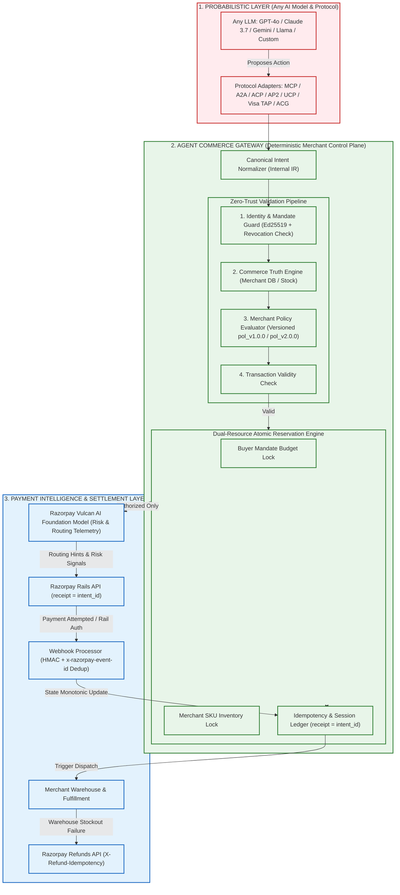

# Agent Commerce Gateway (ACG / MACCP)
> **Merchant-Side Control Plane for AI-Originated Transactions on Razorpay**  
> *Razorpay AI Buildathon — Track 01: AI Growth & Agentic Commerce*

[](https://agent-commerce-gateway.web.app)
[](https://agent-commerce-gateway.web.app)
[]()
[]()
[]()
[]()
[]()
[]()
[]()
[]()

---

> 🌐 **Live Deployed Control Plane:** [https://agent-commerce-gateway.web.app](https://agent-commerce-gateway.web.app)  
> 📦 **GitHub Repository:** [https://github.com/Viswanath129/agent-commerce-gateway](https://github.com/Viswanath129/agent-commerce-gateway)

---

## 🎯 The Core Thesis & Strategic Positioning

> **“The model can propose anything. It cannot authorize anything.”**  
> **“Vulcan provides downstream payment intelligence; ACG enforces deterministic merchant authorization.”**

### Strategic Elevator Pitch
> **“We don't replace the agent, the protocol, the payment intelligence, or Razorpay. We provide the merchant-side control boundary that governs the financial actions those systems are allowed to cause.”**

### Scope & Architectural Boundary: An Optional Merchant-Side Control Layer
Razorpay already operates comprehensive agentic surfaces: Agentic Payments, ChatGPT Apps with OAuth, the Razorpay MCP Server (officially connecting Claude, Cursor, Windsurf, VS Code, Replit, and Gemini CLI), Sarvam voice-first conversational commerce, and RazorpayX agentic banking for payouts and collections.

**ACG does NOT sit in front of all Razorpay AI.** ACG is an **optional merchant-side control boundary for agent-originated financial actions**:

```text
Razorpay-Native Agentic Experiences
(ChatGPT App / Voice Commerce / MCP Server / RazorpayX Payouts)
                 │
                 ├─────────────────────────┐
                 │                         │
                 ▼                         ▼
            Native Flow                   ACG Control Boundary
                                           │
                                           ▼
                                 Merchant Policy (v1 / v2)
                                 + Cryptographic Authority (Ed25519)
                                 + Resource Locks (Budget & Stock)
                                 + Tamper-Evident SHA-256 Audit Provenance
```

### Strategic System Flow
```text
ANY AI MODEL / AGENT
GPT • Claude • Gemini • Open Models
│
▼
AGENT ADAPTERS
MCP • A2A • ACP • AP2 • UCP • REST
│
▼
┌───────────────────────────┐
│           ACG             │
│  MERCHANT CONTROL PLANE   │
│                           │
│ Identity & Agent Trust    │
│ Financial Action Ingress  │
│ Canonical Intent IR       │
│ Buyer Mandate (Ed25519)   │
│ Commerce Truth (DB Price) │
│ Merchant Policy (v1 / v2) │
│ Budget & Inventory Lock   │
│ Instant Revocation        │
│ Webhook Reconciliation    │
│ Tamper-Evident Audit      │
└─────────────┬─────────────┘
              │
      AUTHORIZED ACTION
              │
              ▼
    PAYMENT INTELLIGENCE
       Razorpay Vulcan
    [ADVISORY / TELEMETRY]
              │
              ▼
      RAZORPAY EXECUTION
     Orders / UPI / Cards
              │
              ▼
    WEBHOOK / AUDIT LOG
```

### The Razorpay Vulcan Distinction (Separation of Concerns)
Razorpay announced **Vulcan**, its AI Payments Foundation Model (trained on ~3T data points / ~4B payments) for real-time routing, fraud detection, and payment reliability:

- **Razorpay Vulcan answers:**  
  *“Given an authorized payment, how can the payment succeed safely and efficiently?”* (Downstream execution telemetry, routing hints, fraud risk signals).
- **ACG answers:**  
  *“Should this agent be allowed to cause this payment at all?”* (Upstream authorization authority, cryptographic mandates, catalog truth, merchant policy, dual-resource ACID locking).

**Intelligence provides signals; ACG retains authority.** Vulcan is modeled as an **architecture-ready downstream advisory provider** (as no public developer inference API currently exists). ACG never delegates binding authority to an inference model.

---

## 🌐 Ecosystem Compatibility Matrix (Evidence-Backed Classifications)

| Technology | Role | ACG Relationship & Status | Evidence / Verification Note |
| :--- | :--- | :--- | :--- |
| **Native ACG Protocol** | Direct Mandate Format | **LIVE** | Verified with Ed25519 signatures, budget caps, instant revocation |
| **REST Financial Ingress** | Direct API Endpoint | **LIVE** | Verified end-to-end against live Fastify HTTP testbench |
| **Razorpay Sandbox Rails** | Primary Settlement Rail | **LIVE** | Live zero-mock sandbox integration (`receipt = intent_id`) |
| **Model Context Protocol (MCP)** | Agent ↔ Tools / Data | **ADAPTER READY** | Normalizes Claude/ChatGPT/Cursor `tools/call` into Canonical IR |
| **Agent2Agent Protocol (A2A)** | Inter-Agent Communication | **ADAPTER READY** | Normalizes Linux Foundation A2A commerce task RPCs |
| **Agentic Commerce Protocol (ACP)** | Commerce Cart Standard | **ADAPTER READY** | Normalizes open commerce cart & order envelopes |
| **Agent Payments Protocol (AP2)** | Payment Authorization | **ADAPTER READY** | Maps AP2 to ACG IR; accommodates non-deterministic ECDSA JWT binding |
| **Universal Commerce Protocol (UCP)**| Cross-Surface Journeys | **ADAPTER READY** | Bridges Google UCP search & voice assistant journeys into ACG IR |
| **Visa Trusted Agent Protocol (TAP)**| Agent Identity Attestation | **DESIGN** | Hardware TEE attestation token container design |
| **Razorpay Vulcan AI FM** | Payment Foundation Model | **ARCHITECTURE READY** | Modeled downstream telemetry provider; no public API exists |
| **UPI Reserve Pay** | Pre-authorized Spending | **RAIL** | Delegated pre-authorized spending rail integration target |
| **Cards & Netbanking** | Network Tokenization | **RAIL** | Card tokenization & standard web checkout rail |
| **Machine Payments (x402 / MPP)** | Machine / HTTP Rail | **PLUGGABLE** | HTTP-native machine micro-payment rail architecture |

---

## 🏗️ System Architecture



---

## 🛡️ Seven Layers of Deterministic Defense

1. **Cryptographic Mandate Authority & Instant Revocation (Ed25519):**  
   The human buyer cryptographically delegates an authorized spending budget, expiry timestamp, and category whitelist. Any modification by an adversarial agent invalidates the signature (`401 INVALID_MANDATE_SIGNATURE`). Principals can revoke mandates instantly in the control plane (`403 MANDATE_REVOKED`).
2. **Deterministic Commerce Truth (Database DB Price):**  
   ACG completely ignores LLM price/tax claims. It re-queries the merchant catalog database to calculate real prices, taxes, and stock levels (`TransactionValidity = EffectivePermission ∩ CommerceTruth`).
3. **Dual-Resource Atomic Reservation (ACID Lock):**  
   Simultaneously locks **Buyer Mandate Budget** (preventing overspend) and **Merchant SKU Inventory** (preventing overselling) in a single atomic transaction before touching payment rails.
4. **Documented Razorpay Idempotency Rails:**  
   - Orders: Uses unique `receipt = intent_id` (preventing duplicate order creation).
   - Refunds: Uses official `X-Refund-Idempotency` HTTP header.
5. **Webhook Deduplication & Outbox Reconciler:**  
   Verifies HMAC-SHA256 signatures, deduplicates via `x-razorpay-event-id`, enforces monotonic forward state transitions, and resolves dropped events via active polling.
6. **Reproducible Versioned Audit Ledger:**  
   Appends every decision to a tamper-evident SHA-256 hash chain recording the exact immutable `policy_version` and timestamp.
7. **Active Policy Mutation Invariants:**  
   Merchant policy changes take effect in real-time at execution without retroactively corrupting active transactions or historical audit provenance.

---

### 🧪 Automated Verification Test Suite (50/50 Passing)

```bash
npm test
```

```text
 ✓ src/core/__tests__/hooks.test.ts (1 test)
 ✓ src/core/__tests__/gateway.test.ts (3 tests)
 ✓ src/core/__tests__/typed_api_client.test.ts (8 tests)
 ✓ src/core/__tests__/ui_dashboard_integration.test.ts (11 tests)
 ✓ src/core/__tests__/protocol_adapters.test.ts (13 tests)
    ✓ 1.1 Native ACG Adapter - Normalizes direct canonical payload
    ✓ 1.2 MCP Adapter - Normalizes Model Context Protocol tools/call invocation
    ✓ 1.3 A2A Adapter - Normalizes Linux Foundation Agent2Agent RPC message
    ✓ 1.4 ACP Adapter - Normalizes Agentic Commerce Protocol container
    ✓ 1.5 AP2 Adapter - Normalizes Agent Payments Protocol v0.2 authorization
    ✓ 1.6 UCP Adapter - Normalizes Google Universal Commerce Protocol journey
    ✓ 1.7 Visa TAP Adapter - Verifies agent trust attestation token
    ✓ 2.1 Vulcan AI FM - Evaluates downstream risk signals & optimal rail telemetry
    ✓ 3.1 Universal Ingress via MCP - Executes atomic checkout with Vulcan hints
    ✓ 3.2 Universal Ingress via AP2 - Enforces full cryptographic mandate verification
    ✓ 3.3 Protocol Error Handling - Rejects unknown protocol gracefully with 400
    ✓ 4.1 Compatibility Matrix API - Returns accurate model, protocol, intelligence state
    ✓ 4.2 Test-Adapter API - Interactively executes protocol adapter live simulation
 ✓ src/core/__tests__/adversarial_suite.test.ts (14 tests)

Test Files: 6 passed (6) | Tests: 50 passed (50) | Duration: 2.24s
```

---

## ⏱️ Empirical Performance Benchmark: Time-to-First-AI-Transaction

```bash
npm run benchmark
```

```text
===========================================================================
  ACG EMPIRICAL BENCHMARK: TIME-TO-FIRST-AI-TRANSACTION
===========================================================================

⏱️  Execution Milestones (Cold-Start In-Memory Test):
   ├── 1. Gateway Boot & Policy Engine:      270.94 ms
   ├── 2. Catalog Ingestion & Truth Link:    0.42 ms
   ├── 3. Ed25519 Principal Mandate Sign:    3.36 ms
   └── 4. 6-Phase Zero-Trust Agent Checkout: 63.35 ms

🚀 LATEST MEASURED COLD-RUN: 338.08 ms
   ├── Gateway Response Status: 201 Created
   ├── Razorpay Order Created:  order_065f15f7ae1b691e
   └── Policy Version Pinned:   pol_v1.0.0

💼 Measured Merchant Integration Time:
   ├── Step 1: Install & configure .env (Razorpay API Keys): ~3-5 mins
   ├── Step 2: Define JSON Policy DSL (Allowed categories & caps): ~2 mins
   ├── Step 3: Connect DB Catalog / REST endpoint: ~5 mins
   └── Total Merchant Integration Time: ~10-12 minutes
===========================================================================
```

---

## 🎬 4-Minute Hackathon Demo Script

Run the automated live simulation:

```bash
npm run demo
```

| Time | Phase | Action & Visual Output | Key Takeaway |
| :--- | :--- | :--- | :--- |
| **0:00 - 0:45** | **1. Adversarial Interception** | Agent attempts to buy ₹14,160 chair with ₹5,000 mandate $\rightarrow$ Gateway blocks (`403 MANDATE_BUDGET_EXCEEDED`). Razorpay **NOT CALLED**. | *“The model can propose anything. It cannot authorize anything.”* |
| **0:45 - 1:45** | **2. Golden Path Execution** | Agent submits valid intent for ₹2,124 Optical Mouse $\rightarrow$ Ed25519 verified $\rightarrow$ DB truth resolved $\rightarrow$ Razorpay Order created (`receipt = intent_id`). | Seamless autonomous commerce on Razorpay rails. |
| **1:45 - 2:45** | **3. High-Concurrency Race** | Remaining balance is ₹2,876. Two subagents attack simultaneously with ₹2,124 carts $\rightarrow$ Agent A: `201 ALLOW`, Agent B: `409 MANDATE_EXHAUSTED`. | Dual-Resource Lock eliminates concurrent double-spend. |
| **2:45 - 3:30** | **4. Failure & Safe Refund** | Warehouse damaged item post-capture $\rightarrow$ ACG evaluates policy $\rightarrow$ triggers idempotent refund via `X-Refund-Idempotency`. | Safe refund lifecycle; capital never leaked. |
| **3:30 - 4:00** | **5. Cryptographic Audit & Moat** | Displays live SHA-256 hash-chain trajectory with immutable `policy_version: pol_v1.0.0`. | *“The agent decided what it wanted. The control plane decided whether it was allowed.”* |

---

## 💎 Luxury Control Plane UI (React 19 + TypeScript + Framer Motion)

The ACG frontend is an editorial financial control instrument engineered with **Luxury Editorial FinTech** aesthetics and **Swiss Minimalist Precision**:

```text
┌────────────────────────────────────────────────────────────────────────────────────────┐
│  ACG  //  MERCHANT AGENT COMMERCE CONTROL PLANE                    MODE: SANDBOX (LIVE)│
├───────────────┬────────────────────────────────────────────────────────────────────────┤
│ 01 OVERVIEW   │  LIVE SYSTEM PIPELINE: INTENT → AUTH → TRUTH → POL → RES → RZP → AUDIT │
│ 02 LIVE DEMO  │  LIVE METRICS: 100% Zero-Mock Derived from SQLite Ledger & Razorpay    │
│ 03 TX REGISTRY│  TRANSACTION INSPECTOR: 9-Stage Editorial Decision Trajectory           │
│ 04 MANDATES   │  AUTHORITY CONTRACTS: Ed25519 Cryptographic Verification & Revocation  │
│ 05 POLICIES   │  SPLIT BOUNDARY: Merchant Policy DSL (v1/v2) vs Database Catalog Truth │
│ 06 RESERVATION│  ACID CONCURRENCY: Dual-Resource Budget & SKU Inventory Lock Visualizer │
│ 07 AUDIT      │  PROVENANCE: Tamper-Evident SHA-256 Chain with Deep Line Verification  │
│ 08 HEALTH     │  OPERATIONAL INDEX: 7 Core Subsystem Telemetry Nodes                   │
│ 09 COMPAT     │  ECOSYSTEM MATRIX: Universal Ingress Adapters (MCP/A2A/ACP/AP2/UCP/TAP) │
└───────────────┴────────────────────────────────────────────────────────────────────────┘
```

### The Zero-Mock UI Rule
Every number, status indicator, mandate balance, and cryptographic hash in this interface is **live, measured, or calculated from SQLite state**. The frontend contains **zero hardcoded GMV, transaction counts, or fake latencies**. If the database is fresh, the dashboard honestly displays `0` and empty states.

- **Design Tokens:** 90% Obsidian Neutral (`#10100F`, `#181816`), 5–7% Champagne Gold (`#C8B27A`), 3–5% Muted Semantic Colors (`#6F9B83`, `#A76565`, `#B28A52`).
- **Typography:** Bodoni Moda / Cormorant Garamond (Headings), Inter (UI), IBM Plex Mono (Financial Data & Hashes).
- **Causality Transitions:** Framer Motion state changes execute only *after* the authoritative backend response arrives.

---
## ⚡ Quickstart & Setup

### Prerequisites
- Node.js 22+ or 24+ (uses native `node:sqlite`)
- npm

### Installation
```bash
git clone <repo-url>
cd "RAZOR PAY- Buildathon"
npm install
```

### Environment Configuration
Copy `.env.example` to `.env`:
```env
PORT=3000
HOST=0.0.0.0
RAZORPAY_KEY_ID=rzp_test_your_key_id
RAZORPAY_KEY_SECRET=your_secret_key
RAZORPAY_WEBHOOK_SECRET=your_webhook_secret
DATABASE_PATH=./data/acg_gateway.db
MERCHANT_ID=merch_acme_electronics_01
```

### Run Server, Tests & Build
```bash
# 1. Start Gateway Server & Dashboard (http://localhost:3000)
npm run dev

# 2. Run Complete Automated Test Suite (37 Tests: Core, Adversarial, UI, API Contract, Hooks)
npm test

# 3. Run 19-Vector Live HTTP Penetration Test Suite
npm run pentest

# 4. Compile TypeScript (Backend + Frontend)
npm run build

# 5. Run Benchmark & Simulation
npm run benchmark
npm run demo
```

---

## 🥊 Judge Attack Q&A Defense

**Q1: "Why wouldn't Razorpay just build this natively?"**  
*Answer:* **They could. Our thesis is that this is reusable merchant middleware, not a replacement for Razorpay's payment infrastructure. Razorpay can remain the rail while ACG standardizes the merchant-side control surface across agent protocols and merchant-specific commerce systems.** Razorpay owns payment execution. The merchant owns commerce state. ACG bridges those domains by enforcing merchant-specific policy and atomic commerce-state constraints before invoking the payment rail.

**Q2: "Why isn't this solved by ACP or AP2?"**  
*Answer:* **ACP/AP2 define important agentic-commerce interaction and authorization semantics. ACG implements the merchant-side execution layer that binds those agent requests to local catalog truth, merchant policy, concurrency control, and Razorpay-specific settlement/reconciliation.**

**Q3: "How do you prevent an agent from double-spending across parallel sessions?"**  
*Answer:* Agentic commerce introduces concurrent autonomous actors, so authorization must be treated as a stateful resource, not merely a stateless check. ACG uses an atomic Dual-Resource Reservation Engine locking both the mandate budget and SKU inventory units in a single ACID transaction before creating the Razorpay order.

**Q4: "What if the merchant's warehouse runs out of stock after payment is captured?"**  
*Answer:* ACG transitions the state to `FULFILLMENT_FAILED`, evaluates the merchant's configured policy (`AUTO_REFUND` vs `MANUAL_REVIEW`), and triggers an idempotent refund on Razorpay using the documented `X-Refund-Idempotency` header. Pre-capture transactions strictly block refund calls.

---

## 📜 License
MIT License. Built for the **Razorpay AI Buildathon 2026**.
