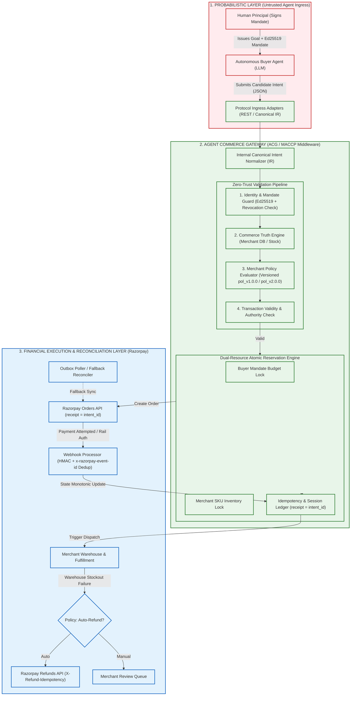

# Agent Commerce Gateway (ACG / MACCP)
> **Merchant-Side Control Plane for AI-Originated Transactions on Razorpay**  
> *Razorpay AI Buildathon — Track 01: AI Growth & Agentic Commerce*

[](https://agent-commerce-gateway.web.app)
[]()
[]()
[]()
[]()
[]()
[]()
[]()
[]()

---

> 🌐 **Live Deployed Control Plane:** [https://agent-commerce-gateway.web.app](https://agent-commerce-gateway.web.app)  
> 📦 **GitHub Repository:** [https://github.com/Viswanath129/agent-commerce-gateway](https://github.com/Viswanath129/agent-commerce-gateway)

---

## 🎯 The Core Thesis

> **“The model can propose anything. It cannot authorize anything.”**  
> **“The agent decided what it wanted. The control plane decided whether it was allowed.”**

As autonomous AI agents (operating via MCP, ACP, or REST) enter digital commerce, giving an LLM direct payment credentials or trusting LLM price arithmetic creates catastrophic prompt-injection, overspend, and race condition vulnerabilities.

**Agent Commerce Gateway (ACG)** is the merchant-side developer middleware that sits between incoming AI buyer agents and Razorpay rails. It normalizes untrusted agent intent, validates cryptographic buyer mandates, enforces merchant policy, atomically locks budgets & inventory, and executes idempotent transactions on Razorpay.

---

## 🏗️ System Architecture



---

## 🛡️ Seven Layers of Deterministic Defense

1. **Cryptographic Mandate Authority & Instant Revocation (Ed25519):**  
   The human buyer cryptographically delegates an authorized spending budget, expiry timestamp, and category whitelist. Any modification by an adversarial agent invalidates the signature (`401 INVALID_MANDATE_SIGNATURE`). Principals can revoke mandates instantly in the control plane (`403 MANDATE_REVOKED`).
2. **Deterministic Commerce Truth (Database DB Price):**  
   ACG completely ignores LLM price/tax claims. It re-queries the merchant catalog database to calculate real prices, taxes, and stock levels (`TransactionValidity = EffectivePermission ∩ CommerceTruth`).
3. **Dual-Resource Atomic Reservation (ACID Lock):**  
   Simultaneously locks **Buyer Mandate Budget** (preventing overspend) and **Merchant SKU Inventory** (preventing overselling) in a single atomic transaction before touching payment rails.
4. **Documented Razorpay Idempotency Rails:**  
   - Orders: Uses unique `receipt = intent_id` (preventing duplicate order creation).
   - Refunds: Uses official `X-Refund-Idempotency` HTTP header.
5. **Webhook Deduplication & Outbox Reconciler:**  
   Verifies HMAC-SHA256 signatures, deduplicates via `x-razorpay-event-id`, enforces monotonic forward state transitions, and resolves dropped events via active polling.
6. **Reproducible Versioned Audit Ledger:**  
   Appends every decision to a tamper-evident SHA-256 hash chain recording the exact immutable `policy_version` and timestamp.
7. **Active Policy Mutation Invariants:**  
   Merchant policy changes take effect in real-time at execution without retroactively corrupting active transactions or historical audit provenance.

---

## 🧪 Adversarial Test Suite (17/17 Passing)

```bash
npm test
```

```text
 ✓ src/core/__tests__/gateway.test.ts (3 tests)
   ✓ Crypto: Generates, signs, and verifies valid Ed25519 mandates
   ✓ Commerce Truth: Calculates real price from DB and ignores LLM price claims
   ✓ Concurrency: Prevents double-spending across parallel subagents

 ✓ src/core/__tests__/adversarial_suite.test.ts (14 tests)
   ✓ Domain 1: Cryptographic Mandate Authority > Valid Ed25519 mandate signature
   ✓ Domain 1: Cryptographic Mandate Authority > Rejects tampered budget in payload [401]
   ✓ Domain 1: Cryptographic Mandate Authority > Rejects expired buyer mandate [403]
   ✓ Domain 2: Commerce Truth & Catalog Grounding > Resolves deterministic price from DB
   ✓ Domain 2: Commerce Truth & Catalog Grounding > Rejects item on inventory stockout [400]
   ✓ Domain 3: High-Concurrency Dual-Resource Locking > True race: 1 ALLOW (201), 1 BLOCK (409)
   ✓ Domain 4: Webhook Processing & Reconciliation > Deduplicates duplicate x-razorpay-event-id
   ✓ Domain 5: Safe Refund Lifecycle > Post-capture failure executes idempotent refund [REFUNDED]
   ✓ Domain 5: Safe Refund Lifecycle > Blocks refund if payment has not been captured
   ✓ Domain 6: Cryptographic Audit Ledger > Verifies SHA-256 hash chain & detects tampering
   ✓ Domain 6: Cryptographic Audit Ledger > Blocks replayed intent submissions with same ID [409]
   ✓ Domain 6: Cryptographic Audit Ledger > Immutably records policy_version for reproducibility
   ✓ Domain 7: Active Mutation Invariants > (#16) Policy mutation during transaction enforces real-time semantics
   ✓ Domain 7: Active Mutation Invariants > (#17) Mandate revocation strictly blocks rogue agent execution [403]

Test Files: 2 passed (2) | Tests: 17 passed (17) | Duration: 1.63s
```

---

## ⏱️ Empirical Performance Benchmark: Time-to-First-AI-Transaction

```bash
npm run benchmark
```

```text
===========================================================================
  ACG EMPIRICAL BENCHMARK: TIME-TO-FIRST-AI-TRANSACTION
===========================================================================

⏱️  Execution Milestones (Cold-Start In-Memory Test):
   ├── 1. Gateway Boot & Policy Engine:      229.62 ms
   ├── 2. Catalog Ingestion & Truth Link:    0.56 ms
   ├── 3. Ed25519 Principal Mandate Sign:    7.36 ms
   └── 4. 6-Phase Zero-Trust Agent Checkout: 48.75 ms

🚀 TOTAL TIME-TO-FIRST-AI-TRANSACTION (Cold Run): 286.30 ms
   ├── Gateway Response Status: 201 Created
   ├── Razorpay Order Created:  order_5e09c5cabdb962d4
   └── Policy Version Pinned:   pol_v1.0.0

💼 Measured Merchant Integration Time:
   ├── Step 1: Install & configure .env (Razorpay API Keys): ~3-5 mins
   ├── Step 2: Define JSON Policy DSL (Allowed categories & caps): ~2 mins
   ├── Step 3: Connect DB Catalog / REST endpoint: ~5 mins
   └── Total Merchant Integration Time: ~10-12 minutes
===========================================================================
```

---

## 🎬 4-Minute Hackathon Demo Script

Run the automated live simulation:

```bash
npm run demo
```

| Time | Phase | Action & Visual Output | Key Takeaway |
| :--- | :--- | :--- | :--- |
| **0:00 - 0:45** | **1. Adversarial Interception** | Agent attempts to buy ₹14,160 chair with ₹5,000 mandate $\rightarrow$ Gateway blocks (`403 MANDATE_BUDGET_EXCEEDED`). Razorpay **NOT CALLED**. | *“The model can propose anything. It cannot authorize anything.”* |
| **0:45 - 1:45** | **2. Golden Path Execution** | Agent submits valid intent for ₹2,124 Optical Mouse $\rightarrow$ Ed25519 verified $\rightarrow$ DB truth resolved $\rightarrow$ Razorpay Order created (`receipt = intent_id`). | Seamless autonomous commerce on Razorpay rails. |
| **1:45 - 2:45** | **3. High-Concurrency Race** | Remaining balance is ₹2,876. Two subagents attack simultaneously with ₹2,124 carts $\rightarrow$ Agent A: `201 ALLOW`, Agent B: `409 MANDATE_EXHAUSTED`. | Dual-Resource Lock eliminates concurrent double-spend. |
| **2:45 - 3:30** | **4. Failure & Safe Refund** | Warehouse damaged item post-capture $\rightarrow$ ACG evaluates policy $\rightarrow$ triggers idempotent refund via `X-Refund-Idempotency`. | Safe refund lifecycle; capital never leaked. |
| **3:30 - 4:00** | **5. Cryptographic Audit & Moat** | Displays live SHA-256 hash-chain trajectory with immutable `policy_version: pol_v1.0.0`. | *“The agent decided what it wanted. The control plane decided whether it was allowed.”* |

---

## ⚡ Quickstart & Setup

### Prerequisites
- Node.js 22+ or 24+ (uses native `node:sqlite`)
- npm

### Installation
```bash
git clone <repo-url>
cd "RAZOR PAY- Buildathon"
npm install
```

### Environment Configuration
Copy `.env.example` to `.env`:
```env
PORT=3000
HOST=0.0.0.0
RAZORPAY_KEY_ID=rzp_test_your_key_id
RAZORPAY_KEY_SECRET=your_secret_key
RAZORPAY_WEBHOOK_SECRET=your_webhook_secret
DATABASE_PATH=./data/acg_gateway.db
MERCHANT_ID=merch_acme_electronics_01
```

### Run Server, Tests & Build
```bash
# 1. Start Gateway Server & Dashboard (http://localhost:3000)
npm run dev

# 2. Run Complete Automated Test Suite (37 Tests: Core, Adversarial, UI, API Contract, Hooks)
npm test

# 3. Run 19-Vector Live HTTP Penetration Test Suite
npm run pentest

# 4. Compile TypeScript (Backend + Frontend)
npm run build

# 5. Run Benchmark & Simulation
npm run benchmark
npm run demo
```

---

## 🥊 Judge Attack Q&A Defense

**Q1: "Why wouldn't Razorpay just build this natively?"**  
*Answer:* **They could. Our thesis is that this is reusable merchant middleware, not a replacement for Razorpay's payment infrastructure. Razorpay can remain the rail while ACG standardizes the merchant-side control surface across agent protocols and merchant-specific commerce systems.** Razorpay owns payment execution. The merchant owns commerce state. ACG bridges those domains by enforcing merchant-specific policy and atomic commerce-state constraints before invoking the payment rail.

**Q2: "Why isn't this solved by ACP or AP2?"**  
*Answer:* **ACP/AP2 define important agentic-commerce interaction and authorization semantics. ACG implements the merchant-side execution layer that binds those agent requests to local catalog truth, merchant policy, concurrency control, and Razorpay-specific settlement/reconciliation.**

**Q3: "How do you prevent an agent from double-spending across parallel sessions?"**  
*Answer:* Agentic commerce introduces concurrent autonomous actors, so authorization must be treated as a stateful resource, not merely a stateless check. ACG uses an atomic Dual-Resource Reservation Engine locking both the mandate budget and SKU inventory units in a single ACID transaction before creating the Razorpay order.

**Q4: "What if the merchant's warehouse runs out of stock after payment is captured?"**  
*Answer:* ACG transitions the state to `FULFILLMENT_FAILED`, evaluates the merchant's configured policy (`AUTO_REFUND` vs `MANUAL_REVIEW`), and triggers an idempotent refund on Razorpay using the documented `X-Refund-Idempotency` header. Pre-capture transactions strictly block refund calls.

---

## 📜 License
MIT License. Built for the **Razorpay AI Buildathon 2026**.
