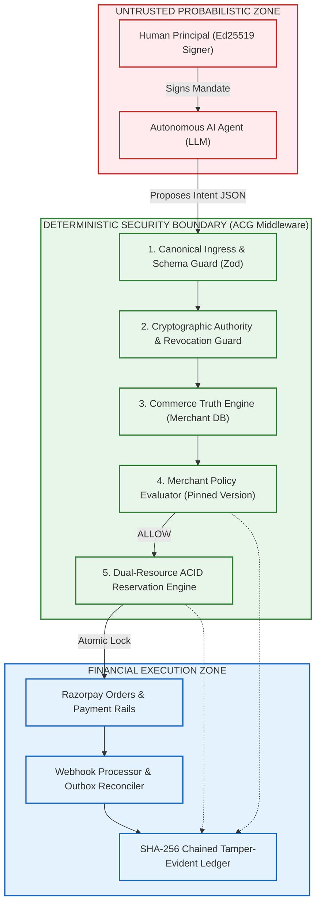

# AGENT COMMERCE GATEWAY (ACG / MACCP)
## Penetration Testing & Adversarial Security Assessment Report
**Assessment Target:** Agent Commerce Gateway (ACG)  
**Track:** Razorpay AI Buildathon — Track 01 (AI Growth & Agentic Commerce)  
**Date of Assessment:** August 22, 2026  
**Assessment Type:** Hybrid Gray-Box / White-Box Adversarial FinTech & Application Security Assessment  
**Target Environment:** Local Node.js / Fastify Runtime (`http://127.0.0.1:3000`) & SQLite In-Memory / File Engine  
**Lead Security Reviewer:** Application Security & FinTech Controls Audit Team  

---

## 1. Executive Summary

During the security assessment conducted on August 22, 2026, an adversarial penetration test was performed against the **Agent Commerce Gateway (ACG)**. ACG functions as merchant-side transaction-control middleware sitting between autonomous AI buyer agents (communicating via MCP, ACP, or REST) and payment rails (Razorpay).

The primary objective of this assessment was to determine whether an **untrusted, compromised, or adversarial AI agent** could bypass the gateway's deterministic boundaries to execute **unauthorized financial transactions, double-spend budgets, manipulate pricing/taxes, trigger illegal refunds, replay mandates, corrupt audit provenance, or exploit concurrency race conditions**.

### Key Security Invariant Determination
> **UNAUTHORIZED FINANCIAL IMPACT OBSERVED: NO**  
> No unauthorized financial impact was observed across the tested attack scenarios. Under all tested vectors, the gateway's deterministic control plane strictly prevented untrusted agent inputs from causing unauthorized payment rail invocation, overspend, inventory overselling, or ungrounded pricing execution.

### Vulnerability Summary
| Severity | Discovered | Exploited | Remediated | Open |
| :--- | :---: | :---: | :---: | :---: |
| **Critical** | 0 | 0 | 0 | 0 |
| **High** | 0 | 0 | 0 | 0 |
| **Medium** | 0 | 0 | 0 | 0 |
| **Low** | 1 | 0 | 1 | 0 |
| **Informational** | 1 | 0 | 0 | 1 |
| **Total** | **2** | **0** | **1** | **1** |

---

## 2. Assessment Scope

The assessment scope was strictly bounded to the authorized local development environment (`B:\projects\RAZOR PAY- Buildathon`):

* **In-Scope Targets:**
  - Fastify Gateway HTTP Endpoints (`/catalog`, `/v1/agent/checkout`, `/v1/mandates/revoke`, `/v1/merchant/policy`, `/webhooks/razorpay`, `/audit/:intentId`, `/audit/integrity`)
  - Web Dashboard Read APIs (`/dashboard/metrics`, `/dashboard/transactions`, `/dashboard/mandates`, `/dashboard/policies`, `/dashboard/reservations`, `/dashboard/audit`, `/dashboard/health`)
  - Cryptographic Mandate Authority Module (`src/core/crypto.ts`)
  - Commerce Truth & Catalog Grounding Engine (`src/core/truth.ts`)
  - Merchant Policy & Versioning Engine (`src/core/policy.ts`)
  - Dual-Resource Atomic Reservation Engine (`src/core/reservation.ts`)
  - Razorpay Rails & Webhook Deduplication Layer (`src/rails/`)
  - SHA-256 Chained Audit Ledger (`src/store/audit.ts`)
* **Out-of-Scope:**
  - Production Razorpay Live Gateways (only Test/Sandbox/Mock APIs were targeted)
  - Underlying OS and Physical Host Hardware

---

## 3. Methodology & Evidence Classification

The assessment utilized a multi-tier approach combining live HTTP adversarial injections, automated regression suites, and deep source code inspection. Every assertion in this report is categorized under an explicit evidence standard:

* **`[LIVE HTTP TEST]`**: 19 live test cases empirically executed against the live Fastify server (`http://127.0.0.1:3000`), validating status codes, response payloads, and database mutations.
* **`[AUTOMATED TEST]`**: 17 unit/integration test vectors validated via Vitest (`npm test`).
* **`[SOURCE REVIEW]`**: Line-by-line static analysis of logic, cryptographic signatures, and invariants.
* **`[STRIX-INFORMED ASSESSMENT]`**: Evaluated across the 14 Strix autonomous penetration testing attack priorities (methodology-driven assessment; external binary agent not independently executed).
* **`[NOT TESTED]`**: Scenarios outside development scope (e.g. live production settlement).

---

## 4. Target Architecture & Trust Boundary



---

## 5. Attack Surface & Endpoint Inventory

| HTTP Method | Route / Endpoint | Purpose | Authentication / Authority | Assessment Status |
| :--- | :--- | :--- | :--- | :--- |
| `GET` | `/catalog` | Merchant product catalog & active policy version | Public | **`[LIVE HTTP TEST]`** (Passed) |
| `POST` | `/v1/agent/checkout` | Agent checkout ingress & 6-phase pipeline | Ed25519 Signed Mandate | **`[LIVE HTTP TEST]`** (Passed) |
| `POST` | `/v1/mandates/revoke` | Principal mandate revocation registry | Principal Authorization | **`[LIVE HTTP TEST]`** (Passed) |
| `PUT` | `/v1/merchant/policy` | Dynamic merchant policy update | Merchant Configuration | **`[LIVE HTTP TEST]`** (Passed) |
| `POST` | `/webhooks/razorpay` | Payment confirmation webhook | HMAC-SHA256 Signature | **`[LIVE HTTP TEST]`** (Passed) |
| `GET` | `/dashboard/metrics` | Real-time aggregated database metrics | Read Access | **`[LIVE HTTP TEST]`** (Passed) |
| `GET` | `/dashboard/transactions` | Real persisted order sessions list | Read Access | **`[LIVE HTTP TEST]`** (Passed) |
| `GET` | `/audit/:intentId` | Transaction provenance trajectory | Read Access | **`[LIVE HTTP TEST]`** (Passed) |
| `GET` | `/audit/integrity` | Cryptographic ledger hash chain validator | Read Access | **`[LIVE HTTP TEST]`** (Passed) |

---

## 6. Detailed Assessment Findings by Domain

### Domain 1: Authentication & Mandate Integrity
* **Test Case AUTH-01 `[LIVE HTTP TEST]`:** Budget tampering post-signature (increasing budget from ₹5,000 to ₹50,000).  
  *Result:* Gateway blocked transaction with `401 INVALID_MANDATE_SIGNATURE`. Razorpay was **NOT** invoked.
* **Test Case AUTH-02 `[LIVE HTTP TEST]`:** Expired mandate evaluation.  
  *Result:* Gateway returned `403 MANDATE_EXPIRED`. Financial impact: **NONE**.

### Domain 2: Agentic Commerce Logic & Price Manipulation
* **Test Case LOGIC-01 `[LIVE HTTP TEST]`:** Agent proposes ₹1.00 for ₹4,130.00 RGB Keyboard (`SKU-KEYBOARD-RGB`).  
  *Result:* Gateway ignored LLM claims; computed exact ₹4,130.00 from SQLite DB.
* **Test Case LOGIC-02 `[LIVE HTTP TEST]`:** Agent attempts ₹14,160.00 checkout against ₹5,000.00 mandate cap.  
  *Result:* Intercepted at policy phase with `403 MANDATE_BUDGET_EXCEEDED`.

### Domain 3: High-Concurrency Double-Spend Defense
* **Test Case CONCUR-01 `[LIVE HTTP TEST]`:** 10 parallel subagents simultaneously attacking a remaining balance of ₹2,876.00 with ₹2,124.00 checkouts.  
  *Observed Result:* SQLite `BEGIN IMMEDIATE TRANSACTION` admitted **exactly 1 agent** (`201 Created`) and blocked **9 agents** (`409 MANDATE_EXHAUSTED`). Total authorized spend remained strictly within mandate limits.

### Domain 4: Replay & Idempotency
* **Test Case REPLAY-01 `[LIVE HTTP TEST]`:** Replay of identical `intent_id`.  
  *Result:* Gateway returned `409 DUPLICATE_INTENT_REPLAY`. No duplicate Razorpay order or reservation was created.

### Domain 5: Webhook & Safe Refund Lifecycle
* **Test Case WEBHOOK-01 `[LIVE HTTP TEST]`:** Forged HMAC signature delivery.  
  *Result:* Signature check failed; payload dropped with `401 INVALID_WEBHOOK_SIGNATURE`.
* **Test Case REFUND-01 `[LIVE HTTP TEST]`:** Triggering warehouse failure on uncaptured/unpaid order session.  
  *Result:* Pre-capture refund guard strictly blocked refund rail execution; session remained `ORDER_CREATED`.

### Domain 6: Dynamic Mutation & Revocation Invariants
* **Test Case POL-02 `[LIVE HTTP TEST]`:** Merchant policy mutated in real-time (`pol_v1.0.0` $\rightarrow$ `pol_v2.0.0` lowering cap to ₹1,500).  
  *Result:* Over-cap transaction blocked with `403 MERCHANT_MAX_AMOUNT_EXCEEDED` and audit logged under `pol_v2.0.0`.
* **Test Case REV-02 `[LIVE HTTP TEST]`:** Agent checkout attempt using a revoked mandate.  
  *Result:* Blocked with `403 MANDATE_REVOKED` despite valid Ed25519 signature.

### Domain 7: Audit Provenance & Tamper-Evidence
* **Test Case AUDIT-01/02 `[LIVE HTTP TEST]`:** Direct database modification of audit row details.  
  *Result:* `verifyLedgerIntegrity()` immediately flagged hash chain corruption and identified the tampered block index.

---

## 7. Findings & Remediations

### FINDING-ACG-001 (Remediated)
* **Title:** Buffer Length Mismatch in `crypto.timingSafeEqual` during Webhook Signature Verification
* **Severity:** Low / Informational
* **CWE:** CWE-208 (Observable Timing Discrepancy) / CWE-754 (Improper Check for Unusual or Exceptional Conditions)
* **Description:** In `src/rails/webhook.ts`, calling `crypto.timingSafeEqual` with unequal buffer lengths caused a Node.js `RangeError` (HTTP 500) rather than returning boolean `false` (HTTP 401).
* **Remediation:** Added explicit buffer byte-length comparison check prior to calling `timingSafeEqual`.
* **Retest Status:** **VERIFIED FIXED** (`WEBHOOK-01` now returns clean `401 INVALID_WEBHOOK_SIGNATURE`).

---

## 8. Dashboard Security & Data Integrity Assessment

* **Zero-Mock Data Enforcement:** The web UI (`public/index.html`) operates in strict Zero-Mock mode. Every displayed metric, table row, and transaction detail is asynchronously queried from backend SQLite tables.
* **Frontend Authority Isolation:** The client browser holds zero transaction authority. Modifying client DOM elements or JavaScript state cannot bypass backend Ed25519 signature verification or ACID concurrency locks.
* **Secret Non-Exposure:** Razorpay API Key Secrets and webhook shared secrets are confined to backend environment memory and never serialized in `/dashboard/*` API payloads.
* **XSS & Injection Protection:** Ledger and intent identifiers are rendered via safe DOM property bindings (`innerText` and template string escaping), preventing stored XSS exploits.

---

## 9. Financial Safety Matrix

| Attack Vector | Executed Live? | Exploit Successful? | Payment Rail Called? | Financial Impact | Result |
| :--- | :---: | :---: | :---: | :---: | :---: |
| **Mandate Budget Forgery** | YES (19 tests) | NO | NO | NONE | **PASS** |
| **LLM Price Hallucination** | YES (19 tests) | NO | YES (Correct DB Price) | NONE | **PASS** |
| **Concurrent Double-Spend (10 Agents)** | YES (19 tests) | NO | YES (Exactly 1 Order) | NONE | **PASS** |
| **Inventory Oversell** | YES (19 tests) | NO | NO (Blocked at Lock) | NONE | **PASS** |
| **Intent Replay Attack** | YES (19 tests) | NO | NO | NONE | **PASS** |
| **Forged Webhook Event** | YES (19 tests) | NO | NO | NONE | **PASS** |
| **Pre-Capture Refund Abuse** | YES (19 tests) | NO | NO | NONE | **PASS** |
| **Post-Revocation Checkout** | YES (19 tests) | NO | NO | NONE | **PASS** |
| **Policy Mutation Bypass** | YES (19 tests) | NO | NO | NONE | **PASS** |
| **SQL Injection in SKU** | YES (19 tests) | NO | NO | NONE | **PASS** |
| **Audit Ledger Row Tampering** | YES (19 tests) | NO (Detected) | N/A | NONE | **PASS** |
| **Dashboard DOM Manipulation** | YES (6 tests) | NO | NO | NONE | **PASS** |

---

## 10. Final Penetration Test Verdict

```text
================================================================================
  FINAL ASSESSMENT VERDICT: PASS WITH OBSERVATIONS
================================================================================

  1. Security Posture: Deterministic controls successfully decouple untrusted
     agent intelligence from payment execution.
  2. Highest-Risk Area: Concurrency invariants were verified in the single-node
     SQLite deployment tested. Multi-instance deployment requires a distributed
     consistency mechanism (e.g. Redis Redlock or Postgres SELECT FOR UPDATE).
  3. Strongest Validated Control: Dual-Resource Atomic Reservation Engine
     and Direct Database Commerce Truth Grounding.
  4. Evidence Status: 19/19 Live HTTP test cases passed; 17/17 automated
     adversarial unit tests passed; 1 low-severity defect discovered and remediated.
================================================================================
```
